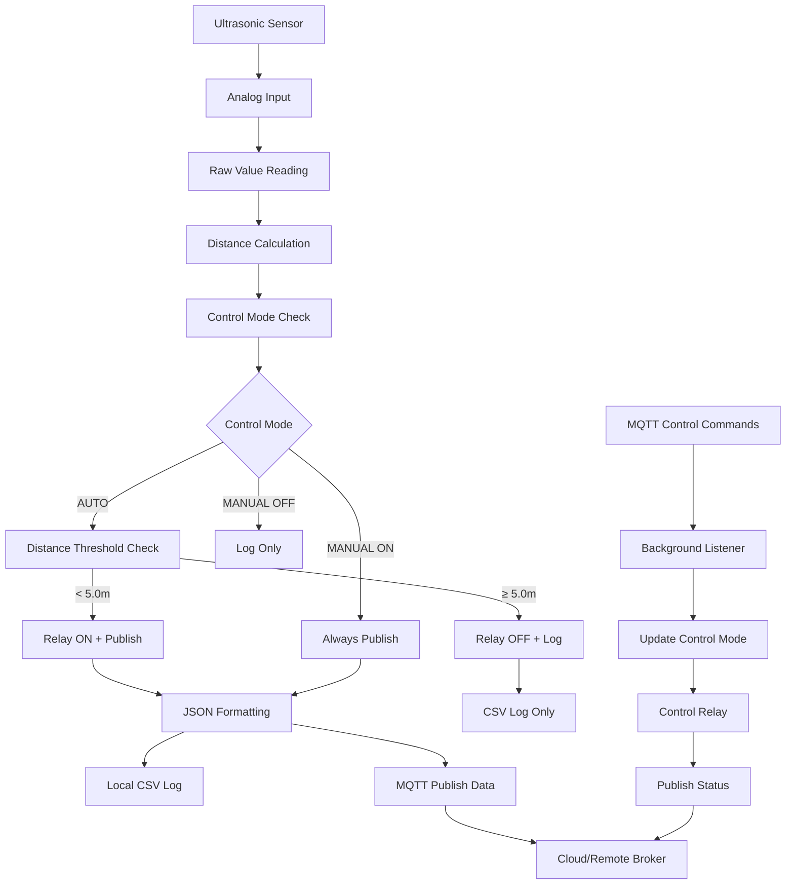

# Maxbotic Ultrasonic Sensor with MQTT Relay Control for Raspberry Pi CM4

[](https://opensource.org/licenses/MIT)
[](https://www.raspberrypi.org/)
[](https://mqtt.org/)

A robust, production-ready solution for interfacing Maxbotic ultrasonic sensors with Raspberry Pi CM4 using analog input. This system provides continuous distance monitoring with real-time data transmission via MQTT protocol, plus remote relay control capabilities for automation and control applications.

## 🚀 Features

- **Real-time Distance Monitoring** - Continuous sensor data acquisition every 2 seconds
- **MQTT Integration** - Automatic data publishing to cloud/remote brokers
- **Remote Relay Control** - MQTT-based relay switching with manual/automatic modes
- **Smart Threshold Control** - Automatic relay activation based on distance thresholds
- **Dual Control Modes** - Switch between automatic and manual relay control
- **JSON Data Format** - Structured data with timestamps and metadata
- **Systemd Service** - Robust background service with automatic startup
- **Local Data Logging** - CSV format with timestamps for offline analysis
- **Real-time Status Updates** - Live relay status publishing via MQTT
- **Error Handling** - Comprehensive error detection and recovery
- **Security Hardened** - Systemd service with restricted permissions
- **Easy Configuration** - Environment-based MQTT settings

## 📋 Requirements

### Hardware
- Raspberry Pi CM4 (Compute Module 4)
- Maxbotic Ultrasonic Sensor (analog output)
- Relay module connected via Modbus RTU (optional)
- Proper analog input setup on CM4

### Software
- Raspberry Pi OS (Bullseye or newer)
- Python 3.7+ (usually pre-installed)
- Internet connection for MQTT transmission

### Dependencies
The installation script will automatically install:
- `mosquitto` - MQTT broker/client
- `mosquitto-clients` - MQTT command-line tools
- `bc` - Mathematical calculations
- `mbpoll` - Modbus polling utility for relay control
- `systemd` - Service management (pre-installed)

## 🔧 Hardware Setup

### Sensor Connection
The ultrasonic sensor should be connected to the analog input interface:

```
Sensor Path: /sys/bus/iio/devices/iio:device0
Raw Data:    cat /sys/bus/iio/devices/iio:device0/in_voltage1_raw
```

### Relay Connection (Optional)
For relay control functionality:
```
Relay Device: /dev/ttyAMA4
Protocol:     Modbus RTU
Baudrate:     9600
Address:      1
```

### Distance Calculation
```
Distance (meters) = (raw_value * 10) / 1303
```

## 📦 Installation

### Quick Start

1. **Clone the repository:**
   ```bash
   git clone https://github.com/hanifr/maxbotic-ultrasonic-rpi-analog-cm4.git
   cd maxbotic-ultrasonic-rpi-analog-cm4
   ```

2. **Run the installation script:**
   ```bash
   chmod +x init.sh
   ./init.sh
   ```

3. **Configure MQTT settings** (see Configuration section below)

4. **Verify installation:**
   ```bash
   sudo systemctl status maxbotic_ultrasonic
   ```

### Manual Installation

If you prefer manual installation:

```bash
# Set timezone
sudo timedatectl set-timezone Asia/Kuala_Lumpur

# Install dependencies
sudo apt update
sudo apt install -y mosquitto mosquitto-clients bc mbpoll

# Enable Mosquitto
sudo systemctl enable mosquitto
sudo systemctl start mosquitto

# Configure and run setup
./primary.sh
```

## ⚙️ Configuration

### MQTT Settings

Edit `mqtt_service.sh` to configure your MQTT broker:

```bash
# MQTT Broker Configuration
export MQTT_BROKER="your-broker.example.com"
export MQTT_PORT=1883
export MQTT_TOPIC="sensors/ultrasonic-01"
export MQTT_CLIENT_ID="cm4-1"

# Optional Authentication
# export MQTT_USERNAME="your_username"
# export MQTT_PASSWORD="your_password"

# Quality of Service (0, 1, or 2)
export MQTT_QOS=2

# Sensor Settings
export MEASUREMENT_INTERVAL=2  # seconds
export OUTPUT_FILE="/home/pi/ultrasonic.txt"
```

### MQTT Topics Structure

The system uses the following topic structure:

```bash
# Base topic (from MQTT_TOPIC)
sensors/ultrasonic-01                    # Sensor data publishing

# Control topics (automatically derived)
sensors/ultrasonic-01/relay/control      # Send relay commands
sensors/ultrasonic-01/relay/status       # Receive relay status updates
```

### Environment Variables

You can also set configuration via environment variables:

```bash
export MQTT_BROKER="broker.example.com"
export MQTT_PORT=1883
export MQTT_TOPIC="sensors/ultrasonic/distance"
```

## 🚀 Usage

### Service Management

```bash
# View real-time logs
sudo journalctl -u maxbotic_ultrasonic -f

# Check service status
sudo systemctl status maxbotic_ultrasonic

# Start/Stop/Restart service
sudo systemctl start maxbotic_ultrasonic
sudo systemctl stop maxbotic_ultrasonic
sudo systemctl restart maxbotic_ultrasonic

# Enable/Disable automatic startup
sudo systemctl enable maxbotic_ultrasonic
sudo systemctl disable maxbotic_ultrasonic
```

### MQTT Relay Control

#### Control Commands

```bash
# Turn relay ON manually (overrides automatic control)
mosquitto_pub -h your-broker.com -t "sensors/ultrasonic-01/relay/control" -m "ON"

# Turn relay OFF manually (overrides automatic control)
mosquitto_pub -h your-broker.com -t "sensors/ultrasonic-01/relay/control" -m "OFF"

# Switch back to automatic mode (distance-based control)
mosquitto_pub -h your-broker.com -t "sensors/ultrasonic-01/relay/control" -m "AUTO"

# Monitor relay status changes
mosquitto_sub -h your-broker.com -t "sensors/ultrasonic-01/relay/status"
```

#### Control Modes

1. **AUTO Mode** (Default)
   - Relay turns ON when distance < 5.0m
   - Relay turns OFF when distance ≥ 5.0m
   - Publishes sensor data only when relay is ON

2. **Manual ON Mode**
   - Relay stays ON regardless of distance
   - Continuously publishes sensor data

3. **Manual OFF Mode**
   - Relay stays OFF regardless of distance
   - Logs distance but doesn't publish via MQTT

### Data Format

#### MQTT Sensor Data Payload (JSON)
```json
{
    "distance": 1.234,
    "unit": "meters",
    "timestamp": "2025-08-04T10:30:45.123",
    "sensor_id": "cm4-1",
    "raw_value": 161
}
```

#### MQTT Relay Status Messages
Relay status updates are published as pipe-delimited messages:
```
ON|Distance: 3.245m < 5.0m|2025-08-04T10:30:45
OFF|MQTT OFF command|2025-08-04T10:31:00
ON|MQTT ON command|2025-08-04T10:32:15
```

#### Local Log File (CSV)
```csv
2025-08-04T10:30:45.123,1.234
2025-08-04T10:30:47.456,1.456
2025-08-04T10:30:49.789,0.987
```

### Manual Testing

```bash
# Test sensor reading
cat /sys/bus/iio/devices/iio:device0/in_voltage1_raw

# Test MQTT connection
mosquitto_pub -h your-broker.com -p 1883 -t test/topic -m "test message"

# Test relay control (if connected)
mbpoll -m rtu -a 1 -b 9600 -P none -s 1 -t 0 -r 2 /dev/ttyAMA4 -- 1  # ON
mbpoll -m rtu -a 1 -b 9600 -P none -s 1 -t 0 -r 2 /dev/ttyAMA4 -- 0  # OFF

# Run sensor script manually
sudo /home/pi/startUltrasonic.sh
```

## 📊 Monitoring & Troubleshooting

### Log Analysis

```bash
# View recent logs
sudo journalctl -u maxbotic_ultrasonic --since "1 hour ago"

# View logs with timestamps
sudo journalctl -u maxbotic_ultrasonic -o short-iso

# Follow logs in real-time
sudo journalctl -u maxbotic_ultrasonic -f

# Filter for relay control messages
sudo journalctl -u maxbotic_ultrasonic -f | grep -i relay
```

### Common Issues

#### Service Won't Start
```bash
# Check service status
sudo systemctl status maxbotic_ultrasonic

# Verify script permissions
ls -la /home/pi/startUltrasonic.sh

# Test script manually
sudo /home/pi/startUltrasonic.sh
```

#### MQTT Connection Issues
```bash
# Test MQTT broker connectivity
mosquitto_pub -h your-broker.com -p 1883 -t test -m "connectivity test"

# Check network connectivity
ping your-broker.com

# Verify MQTT configuration
source mqtt_service.sh && validate_mqtt_config
```

#### Relay Control Issues
```bash
# Check if relay device exists
ls -la /dev/ttyAMA4

# Test manual relay control
mbpoll -m rtu -a 1 -b 9600 -P none -s 1 -t 0 -r 2 /dev/ttyAMA4 -- 1

# Check relay control file status
cat /tmp/relay_control
cat /tmp/relay_state
```

#### Sensor Reading Issues
```bash
# Check if sensor device exists
ls -la /sys/bus/iio/devices/iio:device0/

# Test raw sensor reading
cat /sys/bus/iio/devices/iio:device0/in_voltage1_raw

# Check permissions
ls -la /sys/bus/iio/devices/iio:device0/in_voltage1_raw
```

### Performance Monitoring

```bash
# Monitor system resources
top -p $(pgrep -f startUltrasonic.sh)

# Check disk usage for logs
du -h /var/log/journal/

# Monitor MQTT traffic
mosquitto_sub -h your-broker.com -t your/topic/path

# Monitor relay control traffic
mosquitto_sub -h your-broker.com -t "sensors/ultrasonic-01/relay/+"
```

## 📁 File Structure

```
maxbotic-ultrasonic-rpi-analog-cm4/
├── init.sh                     # Main installation script
├── primary.sh                  # Service setup script
├── mqtt_service.sh             # MQTT configuration
├── README.md                   # This file
├── /home/pi/startUltrasonic.sh # Generated sensor script (with relay control)
├── /etc/systemd/system/maxbotic_ultrasonic.service # System service
└── /tmp/relay_control          # Runtime control state file
└── /tmp/relay_state            # Runtime relay state file
```

## 🔄 Data & Control Pipeline



## 🛠️ Development

### Testing Changes

```bash
# Test configuration changes
source mqtt_service.sh
validate_mqtt_config

# Test script syntax
bash -n primary.sh
bash -n init.sh

# Test service creation without starting
sudo systemctl daemon-reload
sudo systemctl status maxbotic_ultrasonic

# Test MQTT control commands
mosquitto_pub -h localhost -t "sensors/ultrasonic-01/relay/control" -m "ON"
mosquitto_sub -h localhost -t "sensors/ultrasonic-01/relay/status"
```

### Adding Features

The modular design allows easy extension:

- **New sensors**: Modify calculation in `startUltrasonic.sh`
- **Different protocols**: Add to `mqtt_service.sh`
- **Data processing**: Enhance JSON payload structure
- **Alert system**: Add threshold monitoring
- **Multiple relays**: Extend relay control logic
- **Custom control logic**: Modify control mode handling

## 🎯 Use Cases

### Industrial Automation
- **Tank Level Monitoring**: Automatically control pumps based on liquid levels
- **Conveyor Control**: Stop/start systems when objects are detected
- **Safety Systems**: Emergency shutoff when distance thresholds are exceeded

### Smart Building
- **Parking Sensors**: Indicate parking space availability
- **Door Automation**: Open/close doors based on proximity
- **HVAC Control**: Adjust systems based on occupancy detection

### Agricultural Applications
- **Irrigation Control**: Manage water systems based on water levels
- **Feed Systems**: Control dispensing based on container levels
- **Livestock Monitoring**: Track animal presence and movement

## 📄 Example Installation Output

```
[INFO] Maxbotic data acquisition protocol setup started
[SUCCESS] Permissions set successfully
[SUCCESS] Timezone configured successfully
[SUCCESS] Dependencies installed successfully
[SUCCESS] Mosquitto service enabled and started
[INFO] Executing primary setup script
[SUCCESS] All dependencies satisfied
[MQTT-INFO] MQTT configuration validated successfully
[MQTT-INFO] Broker: your-broker.com:1883
[MQTT-INFO] Topic: sensors/ultrasonic-01
[MQTT-INFO] Client ID: cm4-1
[MQTT-INFO] MQTT connection test successful
[SUCCESS] Startup script created at /home/pi/startUltrasonic.sh
[SUCCESS] Systemd service created
[SUCCESS] Service enabled successfully
[SUCCESS] Service started successfully
[SUCCESS] Maxbotic Ultrasonic service with MQTT relay control setup completed successfully!

=== MQTT Relay Control Commands ===
Turn relay ON:       mosquitto_pub -h your-broker.com -t sensors/ultrasonic-01/relay/control -m "ON"
Turn relay OFF:      mosquitto_pub -h your-broker.com -t sensors/ultrasonic-01/relay/control -m "OFF"
Set to AUTO mode:    mosquitto_pub -h your-broker.com -t sensors/ultrasonic-01/relay/control -m "AUTO"
Monitor relay status: mosquitto_sub -h your-broker.com -t sensors/ultrasonic-01/relay/status

=== Control Modes ===
AUTO:    Relay controlled by distance threshold (< 5.0m = ON)
MANUAL:  Relay controlled by MQTT commands (ON/OFF)
```

## 🔧 Advanced Configuration

### Custom Distance Threshold
To modify the 5.0m threshold, edit the startup script:

```bash
# Edit the generated script
sudo nano /home/pi/startUltrasonic.sh

# Find and modify this line:
THRESHOLD=5.0
```

### Multiple Sensor Support
For multiple sensors, create separate service instances:

```bash
# Copy configuration for second sensor
cp mqtt_service.sh mqtt_service_02.sh

# Modify topics and settings
export MQTT_TOPIC="sensors/ultrasonic-02"
export MQTT_CLIENT_ID="cm4-2"
```

### Custom Relay Protocols
To use different relay interfaces, modify the `control_relay()` function in the startup script.

## 🤝 Contributing

1. Fork the repository
2. Create a feature branch (`git checkout -b feature/amazing-feature`)
3. Commit your changes (`git commit -m 'Add amazing feature'`)
4. Push to the branch (`git push origin feature/amazing-feature`)
5. Open a Pull Request

## 📝 License

This project is licensed under the MIT License - see the [LICENSE](LICENSE) file for details.

## 🙏 Acknowledgments

- Maxbotic Inc. for ultrasonic sensor documentation
- Raspberry Pi Foundation for CM4 specifications
- Eclipse Mosquitto project for MQTT implementation
- Modbus community for relay control protocols

## 📞 Support

- **Issues**: [GitHub Issues](https://github.com/hanifr/maxbotic-ultrasonic-rpi-analog-cm4/issues)
- **Documentation**: This README and inline code comments
- **Community**: Feel free to open discussions for questions

---

⭐ **Star this repository if it helped you!**