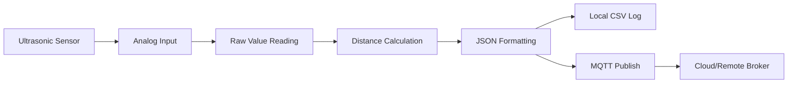

# Maxbotic Ultrasonic Sensor for Raspberry Pi CM4

[](https://opensource.org/licenses/MIT)
[](https://www.raspberrypi.org/)
[](https://mqtt.org/)

A robust, production-ready solution for interfacing Maxbotic ultrasonic sensors with Raspberry Pi CM4 using analog input. This system provides continuous distance monitoring with real-time data transmission via MQTT protocol.

## 🚀 Features

- **Real-time Distance Monitoring** - Continuous sensor data acquisition every 2 seconds
- **MQTT Integration** - Automatic data publishing to cloud/remote brokers
- **JSON Data Format** - Structured data with timestamps and metadata
- **Systemd Service** - Robust background service with automatic startup
- **Local Data Logging** - CSV format with timestamps for offline analysis
- **Error Handling** - Comprehensive error detection and recovery
- **Security Hardened** - Systemd service with restricted permissions
- **Easy Configuration** - Environment-based MQTT settings

## 📋 Requirements

### Hardware
- Raspberry Pi CM4 (Compute Module 4)
- Maxbotic Ultrasonic Sensor (analog output)
- Proper analog input setup on CM4

### Software
- Raspberry Pi OS (Bullseye or newer)
- Python 3.7+ (usually pre-installed)
- Internet connection for MQTT transmission

### Dependencies
The installation script will automatically install:
- `mosquitto` - MQTT broker/client
- `mosquitto-clients` - MQTT command-line tools
- `bc` - Mathematical calculations
- `systemd` - Service management (pre-installed)

## 🔧 Hardware Setup

### Sensor Connection
The ultrasonic sensor should be connected to the analog input interface:

```
Sensor Path: /sys/bus/iio/devices/iio:device0
Raw Data:    cat /sys/bus/iio/devices/iio:device0/in_voltage1_raw
```

### Distance Calculation
```
Distance (meters) = (raw_value * 10) / 1303
```

## 📦 Installation

### Quick Start

1. **Clone the repository:**
   ```bash
   git clone https://github.com/yourusername/maxbotic-ultrasonic-rpi-analog-cm4.git
   cd maxbotic-ultrasonic-rpi-analog-cm4
   ```

2. **Run the installation script:**
   ```bash
   chmod +x init.sh
   ./init.sh
   ```

3. **Configure MQTT settings** (see Configuration section below)

4. **Verify installation:**
   ```bash
   sudo systemctl status maxbotic_ultrasonic
   ```

### Manual Installation

If you prefer manual installation:

```bash
# Set timezone
sudo timedatectl set-timezone Asia/Kuala_Lumpur

# Install dependencies
sudo apt update
sudo apt install -y mosquitto mosquitto-clients bc

# Enable Mosquitto
sudo systemctl enable mosquitto
sudo systemctl start mosquitto

# Configure and run setup
./primary.sh
```

## ⚙️ Configuration

### MQTT Settings

Edit `mqtt_service.sh` to configure your MQTT broker:

```bash
# MQTT Broker Configuration
export MQTT_BROKER="your-broker.example.com"
export MQTT_PORT=1883
export MQTT_TOPIC="your/topic/path"
export MQTT_CLIENT_ID="ultrasonicSensor-$(hostname)"

# Optional Authentication
# export MQTT_USERNAME="your_username"
# export MQTT_PASSWORD="your_password"

# Quality of Service (0, 1, or 2)
export MQTT_QOS=0

# Sensor Settings
export MEASUREMENT_INTERVAL=2  # seconds
export OUTPUT_FILE="/home/pi/ultrasonic.txt"
```

### Environment Variables

You can also set configuration via environment variables:

```bash
export MQTT_BROKER="broker.example.com"
export MQTT_PORT=1883
export MQTT_TOPIC="sensors/ultrasonic/distance"
```

## 🚀 Usage

### Service Management

```bash
# View real-time logs
sudo journalctl -u maxbotic_ultrasonic -f

# Check service status
sudo systemctl status maxbotic_ultrasonic

# Start/Stop/Restart service
sudo systemctl start maxbotic_ultrasonic
sudo systemctl stop maxbotic_ultrasonic
sudo systemctl restart maxbotic_ultrasonic

# Enable/Disable automatic startup
sudo systemctl enable maxbotic_ultrasonic
sudo systemctl disable maxbotic_ultrasonic
```

### Data Format

#### MQTT Payload (JSON)
```json
{
    "distance": 1.234,
    "unit": "meters",
    "timestamp": "2025-07-20T10:30:45.123Z",
    "sensor_id": "ultrasonicSensor-raspberrypi",
    "raw_value": 161
}
```

#### Local Log File (CSV)
```csv
2025-07-20T10:30:45.123Z,1.234
2025-07-20T10:30:47.456Z,1.456
2025-07-20T10:30:49.789Z,0.987
```

### Manual Testing

```bash
# Test sensor reading
cat /sys/bus/iio/devices/iio:device0/in_voltage1_raw

# Test MQTT connection
mosquitto_pub -h your-broker.com -p 1883 -t test/topic -m "test message"

# Run sensor script manually
sudo /home/pi/startUltrasonic.sh
```

## 📊 Monitoring & Troubleshooting

### Log Analysis

```bash
# View recent logs
sudo journalctl -u maxbotic_ultrasonic --since "1 hour ago"

# View logs with timestamps
sudo journalctl -u maxbotic_ultrasonic -o short-iso

# Follow logs in real-time
sudo journalctl -u maxbotic_ultrasonic -f
```

### Common Issues

#### Service Won't Start
```bash
# Check service status
sudo systemctl status maxbotic_ultrasonic

# Verify script permissions
ls -la /home/pi/startUltrasonic.sh

# Test script manually
sudo /home/pi/startUltrasonic.sh
```

#### MQTT Connection Issues
```bash
# Test MQTT broker connectivity
mosquitto_pub -h your-broker.com -p 1883 -t test -m "connectivity test"

# Check network connectivity
ping your-broker.com

# Verify MQTT configuration
source mqtt_service.sh && validate_mqtt_config
```

#### Sensor Reading Issues
```bash
# Check if sensor device exists
ls -la /sys/bus/iio/devices/iio:device0/

# Test raw sensor reading
cat /sys/bus/iio/devices/iio:device0/in_voltage1_raw

# Check permissions
ls -la /sys/bus/iio/devices/iio:device0/in_voltage1_raw
```

### Performance Monitoring

```bash
# Monitor system resources
top -p $(pgrep -f startUltrasonic.sh)

# Check disk usage for logs
du -h /var/log/journal/

# Monitor MQTT traffic
mosquitto_sub -h your-broker.com -t your/topic/path
```

## 📁 File Structure

```
maxbotic-ultrasonic-rpi-analog-cm4/
├── init.sh                     # Main installation script
├── primary.sh                  # Service setup script
├── mqtt_service.sh             # MQTT configuration
├── README.md                   # This file
├── /home/pi/startUltrasonic.sh # Generated sensor script
└── /etc/systemd/system/maxbotic_ultrasonic.service # System service
```

## 🔄 Data Pipeline



## 🛠️ Development

### Testing Changes

```bash
# Test configuration changes
source mqtt_service.sh
validate_mqtt_config

# Test script syntax
bash -n primary.sh
bash -n init.sh

# Test service creation without starting
sudo systemctl daemon-reload
sudo systemctl status maxbotic_ultrasonic
```

### Adding Features

The modular design allows easy extension:

- **New sensors**: Modify calculation in `startUltrasonic.sh`
- **Different protocols**: Add to `mqtt_service.sh`
- **Data processing**: Enhance JSON payload structure
- **Alert system**: Add threshold monitoring

## 📄 Example Installation Output

```
[INFO] Dragino GPS data acquisition protocol setup started
[SUCCESS] Permissions set successfully
[SUCCESS] Timezone configured successfully
[SUCCESS] Dependencies installed successfully
[SUCCESS] Mosquitto service enabled and started
[INFO] Executing primary setup script
[SUCCESS] All dependencies satisfied
[MQTT-INFO] MQTT configuration validated successfully
[MQTT-INFO] Broker: your-broker.com:1883
[MQTT-INFO] Topic: sensors/ultrasonic-01
[MQTT-INFO] Client ID: ultrasonicSensor-raspberrypi
[MQTT-INFO] MQTT connection test successful
[SUCCESS] Startup script created at /home/pi/startUltrasonic.sh
[SUCCESS] Systemd service created
[SUCCESS] Service enabled successfully
[SUCCESS] Service started successfully
[SUCCESS] Maxbotic Ultrasonic service setup completed successfully!
```

## 🤝 Contributing

1. Fork the repository
2. Create a feature branch (`git checkout -b feature/amazing-feature`)
3. Commit your changes (`git commit -m 'Add amazing feature'`)
4. Push to the branch (`git push origin feature/amazing-feature`)
5. Open a Pull Request

## 📝 License

This project is licensed under the MIT License - see the [LICENSE](LICENSE) file for details.

## 🙏 Acknowledgments

- Maxbotic Inc. for ultrasonic sensor documentation
- Raspberry Pi Foundation for CM4 specifications
- Eclipse Mosquitto project for MQTT implementation

## 📞 Support

- **Issues**: [GitHub Issues](https://github.com/yourusername/maxbotic-ultrasonic-rpi-analog-cm4/issues)
- **Discussions**: [GitHub Discussions](https://github.com/yourusername/maxbotic-ultrasonic-rpi-analog-cm4/discussions)
- **Documentation**: [Project Wiki](https://github.com/yourusername/maxbotic-ultrasonic-rpi-analog-cm4/wiki)

---

⭐ **Star this repository if it helped you!**